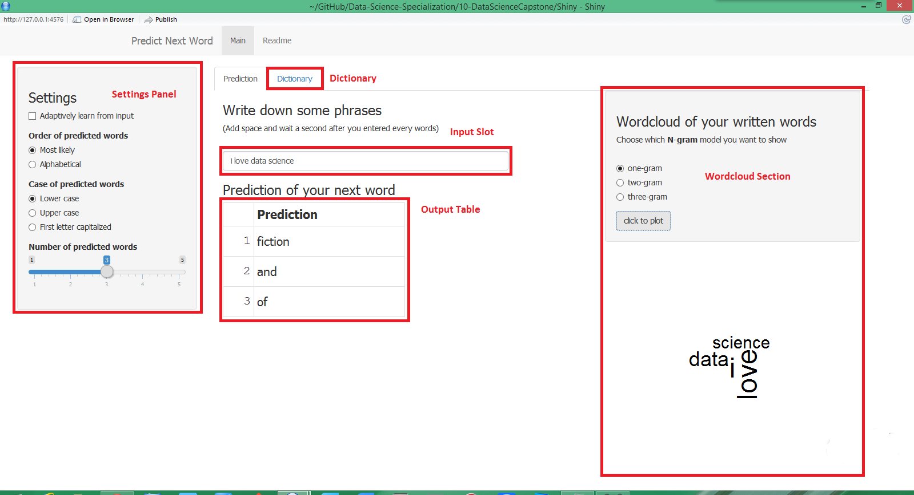

Predict Next Word
========================================================
author: Borye
date: Fri Apr 24 19:20:09 2015
transition: rotate

Application
========================================================
type: sub-section

**Predict Next Word** is a web application for predict the next word based on previous phrases. You can input some words or sentence fragment, and this app will automatically predict your next word based on the given input. 

This app is using **N-gram** + **Backoff** model to model the corpus. The datasets contains the corpus is provided by **SwiftKey** the smart keyboard company.

How to Use
========================================================
type: sub-section

This app is very easy to use. 

- First you could enter some phrases into the **input slot**.
- Then the Predicted words will showup at the **output table**.
- You could also change the settings in the **settings panel** for different form of output.
- After you had several times of attempt, you could use **wordcloud section** to see a wordcloud of your input.
- If you are interesting about the build-in dictionary, you could press **dictionary** button to find out.

User Interface
========================================================
type: sub-section

Further Information
========================================================
type: sub-section

This application is builded using **shiny** and is published on **shinyapps**. To browse this please click on [link](https://borye.shinyapps.io/Weather_Data_Explorer/)

The source code of this application can be found at [GitHub](https://github.com/Borye/Weather_Data_Explorer)
